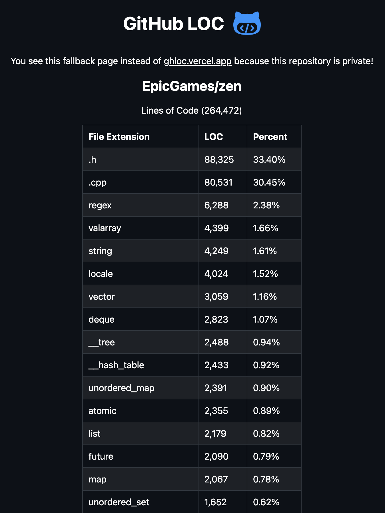
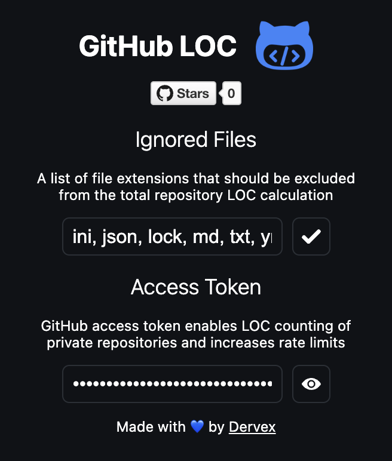

# GitHub LOC

Simple yet elegant Google Chrome extension that allows you to view Lines Of Code of both public and private GitHub repositories with an option to exclude selected languages. Clicking on the stat will take you to the [ghloc.vercel.app](https://ghloc.vercel.app/DervexDev/github-loc) page with even more LOC details. Get the extension from the Chrome Web Store [here](https://chromewebstore.google.com/detail/github-loc/clfbbldiigihjkignlkngblahkpalmhh).

## Extension In Action

## After Clicking

  
  

## Available Settings

## Limitations

Currently it is only possible to get LOC of repositories that are under **50 MBs**!

## Backend

You can see the backend of this extension in the [ghloc-vercel](https://github.com/DervexDev/ghloc-vercel) repository.
